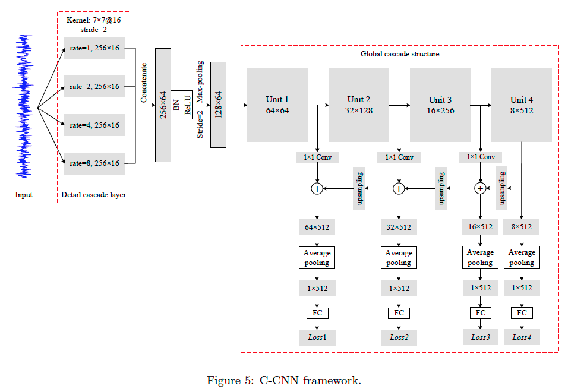
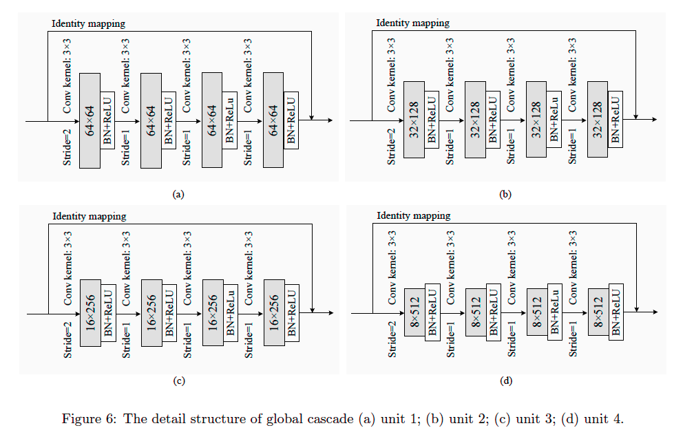
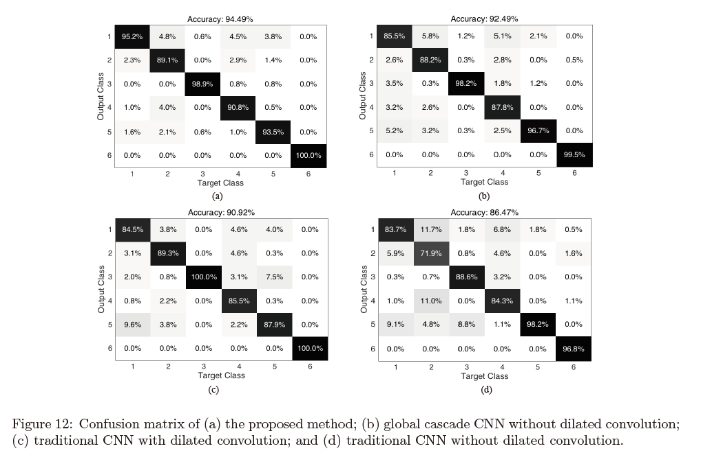

# Feature Pyramid Network + Dialated CNN for Machinery Motor Fault Diagnose

Please download data and pre-trained weights [here](https://drive.google.com/open?id=1IJQv8qc61Ebx02L-xfFzrITLoHqU1eb9)

The network framework is as follows.

The results of fault diagnose on stationary condition:

The results of fault diagnose on un-stationary condition:

